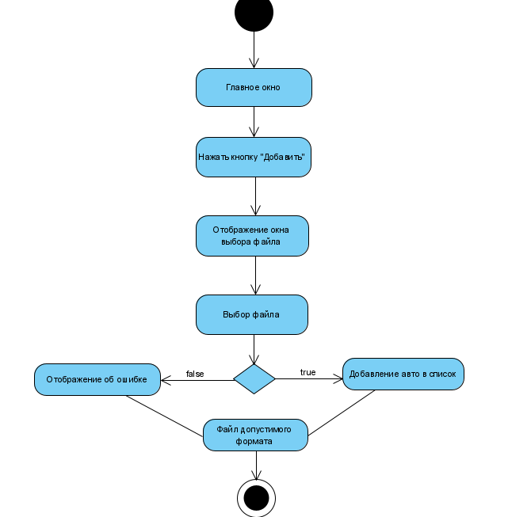
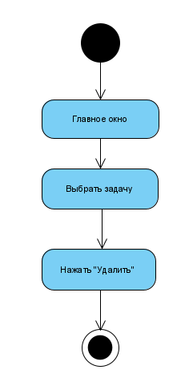
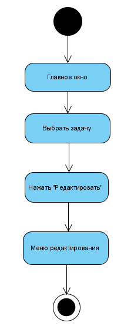

# Диаграмма активностей
---

# Содержание
1. [Открытие файла](#1)
2. [Удаление задач](#2)
3. [Редактирование задачи](#3)

### 1. Открытие файла
При открытии файла пользователь видит окно программы, где пользователь нажимает кнопку Open. После этого приложение отображает окно для поиска файла в файловой системе. При нажатии кнопки Открыть приложение пытается открыть файл. При успешном открытии файл добавляется в плейлист.

### 2. Удаление задач
Пользователь нажимает и удерживает выбранное в списке авто, после чего нажимает кнопку "Удалить".

### 3. Редактирование задачи
Пользователь нажимает выбранную для редактирования задачу, после чего нажимает кнопку "Редактировать".

